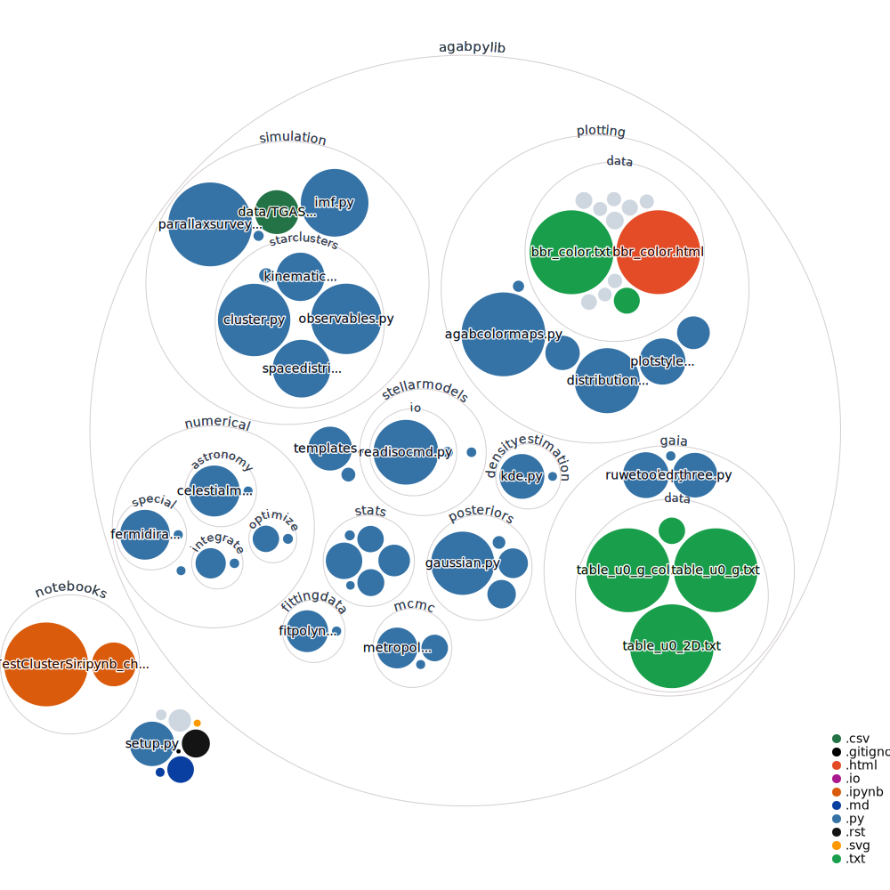

# agabpylib

__Python library with Anthony's private python utilities for data analysis, simulation, plotting, etc.__

_This library is not stable in any sense (functionality, interfaces, etc), and
broken code may be checked in at anytime. There is likely to be outdated or
badly performing code, and there is no committment to fixing issues. Use at
your own risk._

## Documentation

Included with most of the python code, so read the comments or use python's help() function.

## Installation notes

The following python packages are required:

* [numpy](http://www.numpy.org/)
* [scipy](https://www.scipy.org/)
* [matplotlib](https://matplotlib.org/)
* [scikit-learn](http://scikit-learn.org/stable/index.html)
* [pandas](https://pandas.pydata.org/)
* [astropy](https://www.astropy.org/)
* [pystan](https://mc-stan.org/users/interfaces/pystan.html)
* [setuptools](https://pypi.python.org/pypi/setuptools)

## Attribution

Please acknowledge the author if you use this code.

## License

Copyright (c) 2015-2021 Anthony Brown, Leiden Observatory, Leiden University

agabpylib is open source and free software: you can redistribute it and/or
modify it under the terms of MIT license.

You should have received a copy of the MIT licence with this source code. If not, see
[https://opensource.org/licenses/MIT](https://opensource.org/licenses/MIT).

## Visualization of this repository

Made with [repo-visualizer](https://github.com/githubocto/repo-visualizer)

